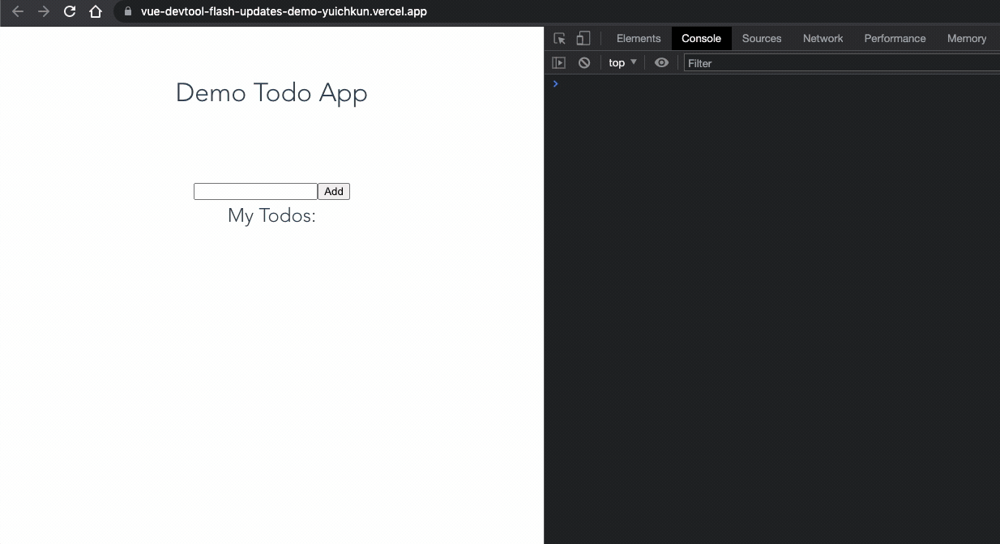
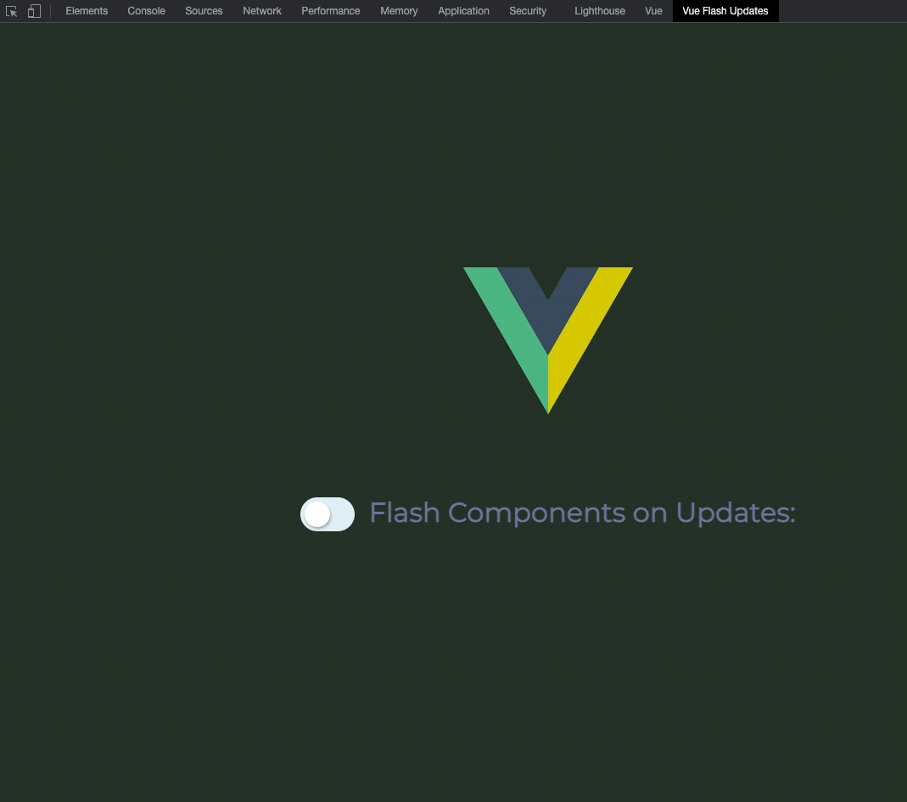

# vue-devtool-flash-updates

<p align="center">
  
</p>

[](https://github.com/RichardLitt/standard-readme)
[](https://img.shields.io/bundlephobia/min/vue-devtool-flash-updates?style=flat-square)
[](https://img.shields.io/npm/dw/vue-devtool-flash-updates?style=flat-square)
[](https://img.shields.io/github/v/release/yuichkun/vue-devtool-flash-updates?style=flat-square)
[](https://chrome.google.com/webstore/detail/vue-devtool-flash-updates/fhoioahocakkbcghinblimnenhdnhmnj)

> A handy devtool that enables highlighting re-rendered components!

This plugin enables Vue projects to quickly identify performance issues by highlighting re-rendered components, just like how [React Developer Tools](https://chrome.google.com/webstore/detail/react-developer-tools/fmkadmapgofadopljbjfkapdkoienihi?hl=en) does it.

## Table of Contents

- [Live Demo🔥](#live-demo🔥)
- [Install](#install)
- [Usage](#usage)
- [Available Options](#available-options)
- [Maintainers](#maintainers)
- [Contributing](#contributing)
- [License](#license)

## Live Demo🔥

*Wanna quickly see it in action?*  

Here's a tedious demo todo app with the plugin enabled:

<p align="center">
  
</p>

1. Download the Chrome extension [here](https://chrome.google.com/webstore/detail/vue-devtool-flash-updates/fhoioahocakkbcghinblimnenhdnhmnj).
1. Visit the demo site [here](https://vue-devtool-flash-updates-demo-yuichkun.vercel.app/).
1. From the devtool panel, select the `Vue Flash Updates` tab and enable the power! ⚡️⚡️

You will see the updated components' names logged in the console as well!

## Install

```bash
npm install -D vue-devtool-flash-updates
```

or

```bash
yarn add -D vue-devtool-flash-updates
```

## Usage

1. [Download the extension from the Chrome Web Store](https://chrome.google.com/webstore/detail/vue-devtool-flash-updates/fhoioahocakkbcghinblimnenhdnhmnj).
2. Install the package and setup the plugin in your desired project.

```js
import FlashUpdates from 'vue-devtool-flash-updates'

Vue.use(FlashUpdates)
```

3. Open the Chrome Dev Tools and enable the plugin.



**It's that easy! 🔥**

## Available Options

Name | Type | Default | Description
--- | --- | --- | ---
`logUpdatedComponents` | Boolean | `false` | When `true`, log the updated components' names in the console with *debug* level.
`isProduction` | Boolean | `false` | When `true`, disable the plugin.

**Tips⚡️**:  
 In order to prevent random users from using the plugin on production sites, you're encouraged to pass a boolean value to the `isProduction` option. Recommended way of doing so is by passing `process.env.NODE_ENV === 'production'` to the plugin, and let module bundlers like webpack to transform the environment variable.

```javascript
import FlashPlugin from 'vue-devtool-flash-updates'
Vue.use(FlashPlugin, {
  isProduction: process.env.NODE_ENV === 'production' // The plugin is disabled on production, enabled on other environments
})
```

## Maintainers

[@yuichkun](https://github.com/yuichkun)

## Contributing

See [the contributing file](CONTRIBUTING.md)!

PRs accepted.

Small note: If editing the README, please conform to the [standard-readme](https://github.com/RichardLitt/standard-readme) specification.

## License

MIT © 2021 Yuichi Yogo
